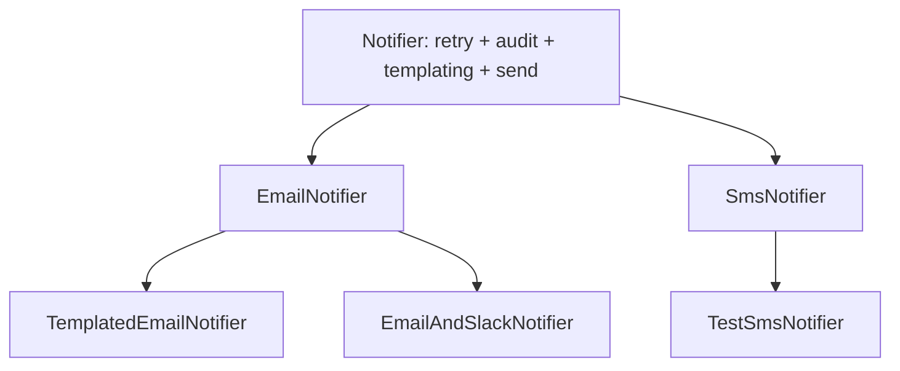
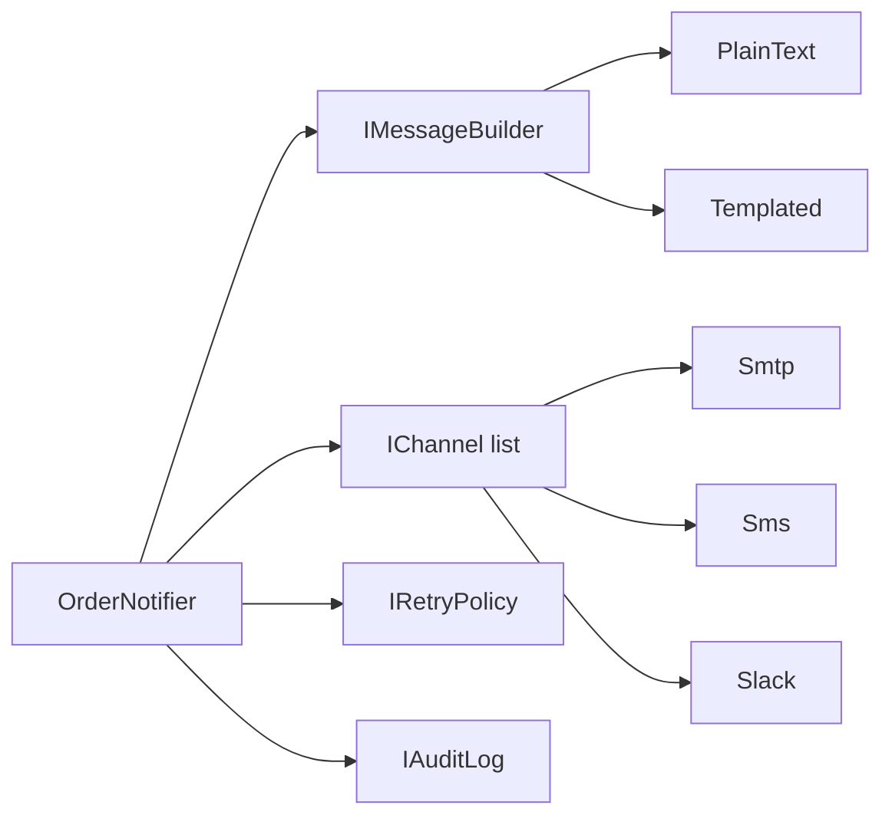

Some of the old .NET Framework Legacy Systems that i been working on more likely i saw it has one base class controller or service that has may common fuction like a helper function.

## The starting point

A notification feature. The first version has one channel and one base class, which is entirely reasonable:

```csharp
public abstract class Notifier
{
    protected abstract Task SendAsync(string recipient, string body);

    public async Task NotifyAsync(Order order)
    {
        var body = $"Order {order.Id} is now {order.Status}.";
        await SendAsync(order.CustomerContact, body);
    }
}

public class EmailNotifier : Notifier
{
    protected override Task SendAsync(string recipient, string body) =>
        _smtp.SendAsync(recipient, "Order update", body);
}
```

Then the requirements arrive, one release at a time:

1. Add SMS.
2. Some notifications need retries; some must not be retried.
3. Marketing wants templated bodies for email but plain text for SMS.
4. Audit needs a log entry for every send, except test sends.
5. High-value orders must notify both email *and* Slack.

## What the hierarchy looks like six months later

```csharp
public abstract class Notifier
{
    protected bool ShouldRetry { get; set; } = true;
    protected bool SkipAudit { get; set; }
    protected virtual bool UsesTemplates => false;

    public async Task NotifyAsync(Order order)
    {
        var body = UsesTemplates
            ? await RenderTemplateAsync(order)
            : $"Order {order.Id} is now {order.Status}.";

        var attempts = ShouldRetry ? 3 : 1;

        for (var i = 0; i < attempts; i++)
        {
            try
            {
                await SendAsync(order.CustomerContact, body);
                break;
            }
            catch (Exception) when (i < attempts - 1)
            {
                await Task.Delay(200 * (i + 1));
            }
        }

        if (!SkipAudit)
        {
            await _audit.RecordAsync(order.Id, GetType().Name);
        }
    }

    protected abstract Task SendAsync(string recipient, string body);
    protected virtual Task<string> RenderTemplateAsync(Order order) =>
        throw new NotSupportedException();
}

public class EmailNotifier : Notifier { /* ... */ }
public class TemplatedEmailNotifier : EmailNotifier { protected override bool UsesTemplates => true; }
public class SmsNotifier : Notifier { public SmsNotifier() => ShouldRetry = false; }
public class TestSmsNotifier : SmsNotifier { public TestSmsNotifier() => SkipAudit = true; }
public class EmailAndSlackNotifier : EmailNotifier { /* sends twice, somehow */ }
```

Nothing here is written by a careless developer we all have full of knowledge and experience. Every line was a reasonable local decision. The problem is structural.



## The symptoms, named

**Protected flags are configuration in disguise.** `ShouldRetry` and `SkipAudit` exist so subclasses can switch off parts of the base class. A subclass that turns off half of its parent is not a specialization; it is a different object wearing the parent's constructor.

**`NotSupportedException` in a virtual method breaks the type.** `RenderTemplateAsync` says every notifier can render a template, and then some of them throw. Any code holding a `Notifier` now has to know which concrete type it really has.

**One base class owns four responsibilities.** Message building, retry policy, transport, and auditing all live in `NotifyAsync`. Changing retry behaviour means editing a class that every notifier inherits from, and re-testing all of them.

**Combinations multiply subclasses.** "Templated + no retry + no audit + two transports" has no home in a tree. You either add another leaf class or add another flag.

**Tests are heavy.** To test retry behaviour you must instantiate a concrete notifier, which drags in SMTP or an SMS gateway. it seem many case need to handle

## name the behaviours as roles

Before writing any new class, list what the base class actually does, and give each one an interface:

> If you out of idea how to call or how to name those things just throw it in a one of your AI like ChatGPT and ask for a name suggestion. they are very good at it.

```csharp
public interface IMessageBuilder
{
    Task<string> BuildAsync(Order order);
}

public interface IChannel
{
    Task SendAsync(string recipient, string body, CancellationToken ct = default);
}

public interface IRetryPolicy
{
    Task ExecuteAsync(Func<Task> action, CancellationToken ct = default);
}
```

Each interface is one job. None of them knows about orders and transports at the same time.

## implement each role once

```csharp
public sealed class PlainTextMessageBuilder : IMessageBuilder
{
    public Task<string> BuildAsync(Order order) =>
        Task.FromResult($"Order {order.Id} is now {order.Status}.");
}

public sealed class TemplatedMessageBuilder(ITemplateEngine engine) : IMessageBuilder
{
    public Task<string> BuildAsync(Order order) =>
        engine.RenderAsync("order-status", order);
}

public sealed class SmtpChannel(ISmtpClient smtp) : IChannel
{
    public Task SendAsync(string recipient, string body, CancellationToken ct = default) =>
        smtp.SendAsync(recipient, "Order update", body, ct);
}

public sealed class SmsChannel(ISmsGateway gateway) : IChannel
{
    public Task SendAsync(string recipient, string body, CancellationToken ct = default) =>
        gateway.SendAsync(recipient, body, ct);
}

public sealed class NoRetry : IRetryPolicy
{
    public Task ExecuteAsync(Func<Task> action, CancellationToken ct = default) => action();
}

public sealed class ExponentialRetry(int attempts = 3) : IRetryPolicy
{
    public async Task ExecuteAsync(Func<Task> action, CancellationToken ct = default)
    {
        for (var i = 0; i < attempts; i++)
        {
            try
            {
                await action();
                return;
            }
            catch when (i < attempts - 1)
            {
                await Task.Delay(200 * (i + 1), ct);
            }
        }
    }
}
```

Every class above is small enough to read in one screen and test without a network.

## compose instead of inherit

The notifier becomes a coordinator that owns nothing but the order of operations:

```csharp
public sealed class OrderNotifier(
    IMessageBuilder builder,
    IEnumerable<IChannel> channels,
    IRetryPolicy retry,
    IAuditLog audit)
{
    public async Task NotifyAsync(Order order, CancellationToken ct = default)
    {
        var body = await builder.BuildAsync(order);

        foreach (var channel in channels)
        {
            await retry.ExecuteAsync(
                () => channel.SendAsync(order.CustomerContact, body, ct), ct);
        }

        await audit.RecordAsync(order.Id, channels.Select(c => c.GetType().Name), ct);
    }
}
```

The "email and Slack" case that needed its own subclass is now a collection with two entries. "No audit in tests" is a `NullAuditLog`. "No retry for SMS" is `NoRetry`. None of these require a new type in a hierarchy.



## move the variation into registration

The combinations that used to be subclasses now live in one readable place:

```csharp
builder.Services.AddKeyedSingleton<IMessageBuilder, TemplatedMessageBuilder>("email");
builder.Services.AddKeyedSingleton<IMessageBuilder, PlainTextMessageBuilder>("sms");

builder.Services.AddSingleton<OrderNotifier>(sp => new OrderNotifier(
    sp.GetRequiredKeyedService<IMessageBuilder>("email"),
    [sp.GetRequiredService<SmtpChannel>(), sp.GetRequiredService<SlackChannel>()],
    new ExponentialRetry(3),
    sp.GetRequiredService<IAuditLog>()));
```

When someone asks "what happens for high-value orders?", the answer is in the composition root, not spread across five constructors in a class tree.

## What the tests look like now

Retry behaviour is testable without touching SMTP:

```csharp
[Fact]
public async Task Retries_until_the_channel_succeeds()
{
    var channel = new FlakyChannel(failures: 2);

    var notifier = new OrderNotifier(
        new PlainTextMessageBuilder(),
        [channel],
        new ExponentialRetry(3),
        new NullAuditLog());

    await notifier.NotifyAsync(Order.Sample());

    Assert.Equal(3, channel.Attempts);
}
```

A fake `IChannel` is a handful of lines because the interface has one method. That is the practical payoff: narrow interfaces make honest test doubles cheap.

## Doing this to existing code safely

You rarely get to rewrite the tree in one commit. A sequence that works:

1. **Add characterization tests** against the current public behaviour, whatever it is.
2. **Extract one role** — retry is usually the easiest — into an interface plus implementation, and have the base class delegate to it. Nothing else changes yet.
3. **Repeat per responsibility** until the base class only orders steps.
4. **Flip the relationship**: turn the base class into a standalone class that takes the roles as constructor parameters.
5. **Delete the subclasses**, replacing each one with a registration.
6. **Seal what remains.** If a class is not designed for inheritance, say so in the type system.

Each step compiles, ships, and is individually revertible.

## When inheritance is still the right call

Composition is a default, not a rule. Inheritance earns its place when:

- the subtype is genuinely a specialization and satisfies the substitution principle everywhere
- the hierarchy is shallow, closed, and unlikely to grow combinations
- you are modelling a closed set of variants — often better expressed with records and pattern matching in modern C#
- a framework requires it (`ControllerBase`, `DbContext`, `Exception`)

The signal to watch is not "am I using inheritance" but "am I turning parts of my parent off". Protected flags, overrides that throw, and subclasses whose names contain `And` are all the same message: these are separate behaviours that were forced into one type.
