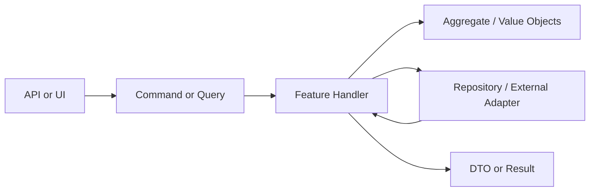

**Vertical Slice Architecture** organizes code by *feature* (or use case), not by technical layer. Each slice is a small, self-contained vertical: one folder, one command or query, one handler, and only the domain types it needs. Combined with **CQRS** (separate read and write paths) and a **thin DDD** core, you get low context per file and a structure that is easy for an AI agent (or a new developer) to implement one slice at a time.

## One slice = one feature

- **Slice** = one user-facing capability (e.g. “Place order”, “Get order details”).
- **Folder** = one slice. No “Controllers”, “Handlers”, “Repositories” at the top level; instead `PlaceOrder/`, `GetOrderDetails/`.
- **Files** = command or query, handler, optional validator, and the minimal domain or persistence it uses. Keep each file small and single-purpose.

This keeps context low: to add or change “Place order”, you open one folder and a few files.

## How the slice fits together



## Folder layout (low context)

```
src/
├── Features/
│   ├── PlaceOrder/
│   │   ├── PlaceOrderCommand.cs
│   │   ├── PlaceOrderHandler.cs
│   │   └── PlaceOrderValidator.cs
│   ├── GetOrderDetails/
│   │   ├── GetOrderDetailsQuery.cs
│   │   └── GetOrderDetailsHandler.cs
│   └── CancelOrder/
│       ├── CancelOrderCommand.cs
│       └── CancelOrderHandler.cs
├── Domain/           # Shared only when needed
│   ├── Order.cs
│   └── OrderRepository.cs
└── Infrastructure/  # DB, external APIs
```

Slices do not depend on each other. They depend on a small **Domain** (entities, value objects, repository interfaces) and **Infrastructure** implements those interfaces.

## CQRS in the slice

- **Command** = write. One class for the command, one handler. Handler loads aggregate(s), calls domain methods, saves. Returns success/failure or an id.
- **Query** = read. One class for the query, one handler. Handler loads data (repository or read model), maps to a DTO, returns. No domain logic.

Each slice owns its request and response types. No giant shared “command bus” types; the slice is the boundary.

## DDD: thin domain

- **Aggregate root** = the entity the slice loads and saves (e.g. `Order`). Keep aggregates small; one root per consistency boundary.
- **Value objects** = immutable types for concepts (e.g. `OrderId`, `Money`). Use them inside the aggregate.
- **Repository interface** = in Domain or next to the slice; implementation in Infrastructure. Slice only knows “load/save this aggregate”.

Avoid “domain services” that span many slices. Prefer logic inside the aggregate or inside the slice’s handler. That keeps the domain small and the slice self-contained.

## Why this helps AI (and humans)

- **Low context**: One feature = one folder. The agent (or developer) only needs to read a few files to implement or change a slice.
- **Small files**: One command, one handler, one query, one handler. Easy to generate or edit in one go.
- **Clear contract**: Command and query types are the API. Handlers are the only place that touches domain or persistence for that use case.
- **No big shared layers**: No “Application layer” with 50 handlers. Slices stay independent; you can add or regenerate one slice without touching others.

## Minimal implementation checklist

1. Create a folder per feature under `Features/`.
2. Add a command or query type (record/class) and a single handler class.
3. Handler: for commands, load aggregate → call method → save; for queries, load data → map to DTO → return.
4. Put shared entities and repository interfaces in `Domain/`; implement repositories in `Infrastructure/`.
5. Wire handlers in the composition root (DI) by feature, not by layer.

This gives you a DDD-CQRS–style design with vertical slices: small, bounded context per feature and small files that are easy for an AI agent to implement or modify one slice at a time.
